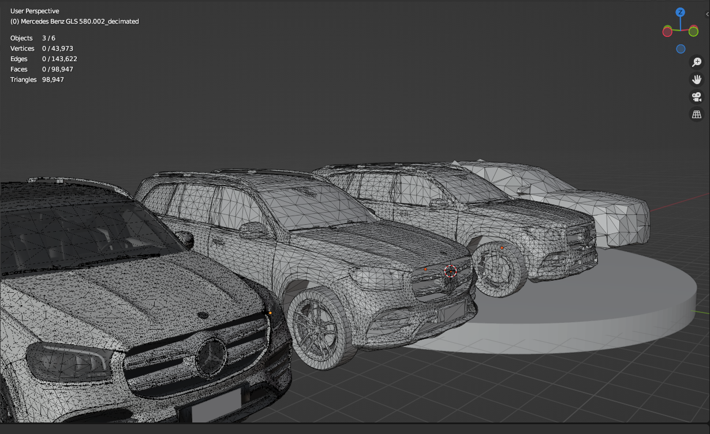

**Andrey Cherkasov BI-PGA semestral work repo.**

_**For the teacher who will check this**:  Development took place in other [repository](https://gitlab.fit.cvut.cz/cherkand/bi-pga-b211) ( so here is almost empty commit history ) I don't want to litter with another repo in your gitlab by adding you as dev. If you want to see commit history please write me on grafit discord (same username as CVUT username) or MSTeams and I will add you_

## 2D

### **ColorShift plug-in**: [Documentation](doc1.adoc)

### Local binary patterns plug-in: [Documentation](doc2.adoc)

## 3D 

### Mesh decimation plug-in: [Documentation](doc3.adoc)

