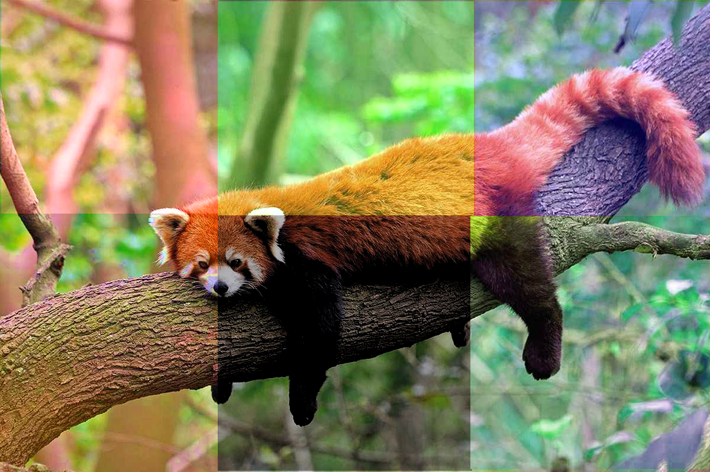
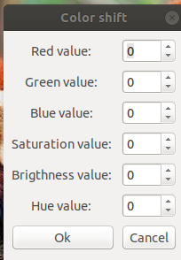

# Color shift plugin

 

## User documentation 

### Task
The task is to create a plug-in implementing per-pixel operation for the entire image. When creating a larger (3+) number of operations and selecting them through the appropriate UI, additional 5 points are added.

### Script: 
link:2D/ColorShift/color_shift.py[*script - color_shift.py*]  

### Installation

_By default plugin is prepared for installation on MacOS._

- In the gimp editor fine Preferences => Folders => Plug-ins. 
- Copy downloaded script file into this folder
- Open gimp. Create new image. In section Xtns you will find a plug-in. 

_Installation for Linux_ 
- Change first raw in the color_shift.py from _#!/Applications/GIMP-2.10.app/Contents/MacOS/python_ to _#!/usr/bin/env python_ The remaining steps is same as MacOS 

### Usage

This plug-in has 6 function. You can see the results of filters on the screennshots: 

 

### Red value: 
- Red color adjustment function
- Negative values take away the red color, positive values add it

### Green value: 
- Red color adjustment function
- Negative values take away the red color, positive values add it

### Saturation value: 
- Saturation adjustment function
- Negative values take away the saturation, positive values add it
- +100 Saturation will made each pixel max saturated

### Brightness value: 
-  Brightness adjustment function
- Negative values take away the Brightness, positive values add it
- +100 Brightness will made each pixel max bright

### Hue value: 
- Hue adjustment function
- Negative values rotate hue clock-wised, positive counter clock-wised
- +360 Hue will made no effect

## Technical documentation 

### Color channnels shifting: 

- Colors shift performed per pixel with clamping:
____
[source,python_] 
for y in range(0, bh):
        for x in range(0, bw):
            pos = (y*bw + x) * bpp
            data = src_pixels[pos:(pos+bpp)]
            # first shift RGB channels then use clamp not to overflow
            data[0] = self.clamp ( data[0] + int(self.rValue), 0, 255 )
            data[1] = self.clamp ( data[1] + int(self.gValue), 0 ,255 )
            data[2] = self.clamp ( data[2] + int(self.bValue), 0, 255 )
____

### Saturation shifting
User entered value is being mapped from ( -100, 100 ) range to ( -1, 1 ) at the begining
____
[source,python_]
self.saturationValue = self.saturationButton.get_value() / 100
____
Then per-pixel shifting with clamp 
____
[source,python_] 
data_hsv.s = self.clamp (data_hsv.s + self.saturationValue, 0.0, 1.0)
____

### Brightness shifting

User entered value is being mapped from ( -100, 100 ) range to ( -1, 1 ) at the begining
____
[source,python_]
self.brightnessValue = self.brigthnessButton.get_value() / 100
____
Then per-pixel shifting with clamp 
____
[source,python_] 
data_hsv.v = self.clamp (data_hsv.v + self.brightnessValue, 0.0, 1.0)
____

### Hue shifting

User entered value is being mapped from ( -360, 360 ) range to ( -1, 1 ) at the begining
____
[source,python_]
self.hueValue = self.hueButton.get_value() / 360
____

Then the hue rotation is applied with possibility to overflow 
_____
[source,python_]
data_hsv.h = data_hsv.h + self.hueValue 
if data_hsv.h > 1.0:
    data_hsv.h -= 1.0
if data_hsv.h < 0: 
    data_hsv.h += 1
_____

## UI 

Each parameter has label box and spin button to change value, +

- Example label: 
____
[source,python_]
# Red channel label
self.redLabel = gtk.Label("Red value: ")
self.redLabel.set_alignment(0.5, 0.5)
self.redLabel.show()
self.table.attach(self.redLabel, 0, 1, 0, 1)
____

- Example spin-button: 
____
[source,python_]
# Saturation spin button
saturationAdjustment = gtk.Adjustment(0, -100, 100, 1)
self.saturationButton = gtk.SpinButton(saturationAdjustment, 1)
self.saturationButton.set_value(shelf[self.shelfkey]["saturation"])
self.saturationButton.show()
self.saturationButton.connect ("value-changed", self.updateSaturationValue )
self.table.attach(self.saturationButton, 1, 2, 3, 4)
____

- All buttons is placed into table. Ok buttonn starts the filtering and cancel button exits plugin 

## Shell 
The plug-in is using shell to save last used values instead of defaults +
Before dialog start. Plug-in ensures that shelf storage exists
____
[source,python_]
if not shelf.has_key(self.shelfkey):
    self.shelfStore(RLevel, GLevel, BLevel, Saturation, Brightness, Hue )
self.create_dialog()
____

Then each spin-button loads last used value through default key: 
____
[source,python_]
self.redButton.set_value(shelf[self.shelfkey]["red"])
____

After OK click plug-in invokes shelfStore function: 
____
[source,python_]
def onOkClicked ( self, widget ):
    # Store values and start shiftring
    self.shelfStore(self.redButton.get_value(), 
                    self.greenButton.get_value(),
                    self.blueButton.get_value(),
                    self.saturationButton.get_value(),
                    self.brigthnessButton.get_value(),
                    self.hueButton.get_value())
    self.shiftColors()
    gimp.quit()
____

shelfStore function itself: 
____
[source,python_]
def shelfStore (self, r, g, b, sat, brightness, hue ):
    shelf[self.shelfkey] = {
        "red":r,
        "green":g,
        "blue":b,
        "saturation":sat,
        "brightness":brightness,
        "hue":hue	
    }
____
## Program structure 

- Main function initializes image and drawable attributes. Checks if we are in editor mode, if so => starts UI. If not => starts filtering 
____
[source,python_]
def shiftColorsMain(self, run_mode, image, drawable, RLevel = 0, GLevel = 0, BLevel = 0, Saturation = 0, Brightness = 0, Hue = 0):
    self.image = image 
    self.drawable = drawable
    # if threre is editor => run UI, otherwise run shifting
    if run_mode == RUN_INTERACTIVE:
        self.dialog.run()
    else:
        self.shiftColors()
____

- Filtering function binds to input, then creates new RGBA layer as output result. 
- Starts per-pixel loop and does shifting 
- Writes new values to output buffer
- Updates layer and exists
