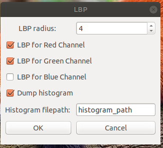

# Local binary patterns plug-in for GIMP 

## General part

My plug-in is able to calculate LBP for a given image ( GRAY, RGB ) and display it as a separate layer(s). Also it can compute histogram ( the frequence for each "pattern" "occurring ) and write it to file.

GIMP version used: *2.8.22*

OS: Linux Ubuntu 18.4 

Dependencies: NumPy  

### Installation: 

1) Download the scirpt: 
link:2D/LBP/lbp_plugin.py[*script - lbp_plugin.py*] 

2) Place it in your GIMP plug-in folder ( you can find these folders in gimp => preferences => folders => plug-in folders )

3) Ensure that Python numpy is installed. To ensure it open terminal, run python, run command import numpy. If you'll get and error "import error: no module named numpy" you should install numpy module. For installation: sudo apt-get install python-numpy ( or eqvivalent command in your package manager )

4) Open GIMP, open image you wan't and you'll find LBP_Plugin in _Xtns category. 

### Usage

Open GIMP, open an image you want to calculate LBP on ( the plug-in supports GRAY and RGB images ). Click on _Xtns => LBP_Plugin and you'll see a plug-in UI 

 

- You can setup the LBP radius value in range 1-50 ( if you don't know what it is => more about it in scientific part ) 
- In case of RGB image you can choose what channels you'd like to calculate LBP on. Each result will be written to separate layer ( by default all 3 )
- You can check "Dump histogram" checkbox to tell plug-in that you want to save histogram ( the frequence for each pattern occurring ) and write a filepath of the file you want to save it to.

After clicking OK the plug-in will run and calculate LBP for the given layers. It'll show the progress bar and the layer on which it works now. Then you can find a visualizations of the LBP in the layers section.

### Examples: 

image::2D/LBP/images/panda.jpeg[Panda, 900, 600] 

[.text-center]
Original panda image

image::2D/LBP/images/panda_lbp_red.jpeg[Panda_LBP_Red, 900, 600] 

[.text-center]
Example of LBP with radius 4 for the red channel

 

[.text-center]
Example of LBP with radius 4 for the green channel

image::2D/LBP/images/panda_lbp_blue.jpeg[Panda_LBP_Blue, 900, 600] 

[.text-center]
Example of LBP with radius 4 for the blue channel

*Example of link:2D/LBP/images/Panda_Histogram[Histogram]*

## Scientific part

Local binary patterns (LBP) is a type of visual descriptor used for classification in computer vision.

Definition from BI-PGA lectures slides

Let's look to it more closely. To calculate LBP value of the pixel, we should take a sample pixel then take a neighbours of this pixel in some radius and determine if the "value" of sample pixel is greater or less then the "value" of each of it's neighbours. The "greater" means binary "0", less or equal means binary "1". After comparing the sample pixel to all of it's neighbours we'll get a binary number in range 0x00 to 0xFF. This number is LBP value for the given pixel. Note that it can be converted to 0-255 integer. With this integer we can represent a grayscale value to visualize the process. So if pixel is more black in LBP layer => it's LBP value is low ( more zeroes ) => it's original "value" is greater than values of it's neighbours. 

But what is the "value" of the pixel? Let's start with the grayscale images. Generally grayscale pixel is represented with the one integer in range 0 to 255. We can say that this is the "value" of the pixel and it's actually works well. But what we can do with the color images? The color image pixel is generally can be represented as RGB vector (r, g, b) where r,g,b are integers in range 0-255 that determines the amount of red, green and blue color in this pixel. Here I see 2 ways: wrong one and the way I did it ( just joking )

First way is to convert the RGB image to grayscale. It's relatively easy operation that trimms 3 dim (r,g,b) vector to 1 dim single grayscale value by taking dot-product with some fancy constants. But as prof.Radek Richter sayed: "Why are you doing yourself a lobotomy?" We'll simply lose a lot of information by doing this transformation, but at the end it will work.  

Second way is to look at each channel of the image as separate pixel value for the LBP calculation. (And this is why my UI has a checkboxes for the different channels) We can make LBP calculation separatly for each channel and save all results in different layers. This is the way how my plug-in works. 

All that remains is histogram. It's nothing more than a table with key = binary pattern and value = how many times did this pattern appeared. Again the example of link:Panda_Histogram[Histogram]

## Programming part 

### Analysis 

First of all i decided to take a look at plug-ins that were already made in previous BI-PGA years. Especially this two: 

Petra Svíčková : https://gitlab.fit.cvut.cz/BI-PGA/stud/svickpet/blob/master/dokumentace1.adoc

Oldřich Milec : https://gitlab.fit.cvut.cz/BI-PGA/stud/milecold/blob/master/dokumentace1.adoc

- The Petra Svickova work uses NumPy library and has a very beautiful, short and compact core algorithm to triverse pixels and calculate LBP value. [source, python]

    binaryNum = []
    #get exactly eight pixels in radius from pixel [x,y]                         
    src_pixels = dataBorder[x-rad:x+1+rad:rad, y-rad:y+1+rad:rad]                
    src_pixels = src_pixels.ravel() #make 2D array 1D 
    #get value of the center pixel [x,y]
    center = src_pixels[4]
    #sequence of indexes
    indexesNeeded = [0,1,2,5,8,7,6,3]
    for i in indexesNeeded:
        if src_pixels[i] > center:       
            binaryNum.append(0) 
        else:       
            binaryNum.append(1)

But unfortunatly her plug-in is only capable of work with grayscale images. 

- Oldřich Milec work is not dependent on NumPy and his core algorithm is much more complicated because of it. The lack of iterating and slicing tools makes it really hard to calculate LBP values which is actually a problem of smartly picking some neighbours indexes from the big matrix. But his plug-in is capable to calculate LBP on RGB images which is great. In case of RGB image he transforms it to grayscale and always outputs result as single grayscale layer. 

[source, python]

        if(bpp == 1):
            #one channel no alpha
            self.pixel_matrix = np.reshape(pixels,(height,width),dtype="uint8")
        else:
            #more than one channel
            self.pixel_matrix = np.reshape(pixels,(height,width,bpp)).astype(dtype=np.float)
            #convert image to grayscale with no alpha
            self.convert_to_gray(bpp)

So based on scientific part of my work, these 2 plug-ins I've decided to concentrate on next features: 

- The plug-in must work on both RGB and GRAY images
- The LBP must be calculated separatly on each layer. No transformations to grayscale 
- I should use NumPy library because it's really improves the readablity and performance of the code 
- If wikipedia mentiones histogram, the plug-in must be able to calculate histogram 

### Intresting parts of code

The core algorithm is actually the same that Petra Svíčková has. I didn't came with better solution so why I should try to make it worse. Here is the snippet from calculate_lbp_internal method 

[source, python] 

    for x in range (radius, bh + radius):
            for y in range (radius, bw + radius):
                pos = ( ( x - radius ) * bw + y - radius) * channels
                binary_values = []
                data = channel_pixels[x - radius: x + 1 + radius:radius,
                                y - radius: y + 1 + radius:radius ]
                data = data.ravel()
                center = data[4]
                indexesNeeded = [0,1,2,3,5,6,7,8]
                for i in indexesNeeded: 
                    if data [ i ] > center: 
                        binary_values.append(0)
                    else:
                        binary_values.append(1)
                st = "".join( ( str ( val ) for val in binary_values ))

But the hot loop is not running only once as it is in other plug-ins. In case of RGB image my plug-in runs it for different channels: 

[source, python]

        if bpp == 1 or bpp == 2:
            self.lbp_for_channel ( "GRAY", src_pixels, bw, bh )
        else: 
            for channel in range ( 0, 3 ): 
                if self.is_channel_active ( channel ):
                    self.lbp_for_channel ( index_to_channel_name ( channel ), src_pixels, bw, bh )

The lbp_for_channel here is the function that prepares context for lbp ( creates layer, making bindings, flushes displays etc )
[source, python]
    def lbp_for_channel ( self, channel_name, src_pixels, bw, bh ):
        bpp = self.drawable.bpp
        (bx1, by1, bx2, by2) = self.drawable.mask_bounds
        (ox, oy) = self.drawable.offsets
        layer = create_layer ( self. image, channel_name + " R = " + str(self.lbp_radius), bw, bh, bpp )
        layer . set_offsets ( bx1 + ox, by1 + oy )
        self . image. add_layer ( layer, 0 )
        dst_rgn = layer . get_pixel_rgn ( 0,0, bw, bh, True, True )
        dst_pixels = array.array ( "B", dst_rgn [0:bw, 0:bh] )
        self.calculate_lbp_internal( dst_pixels, src_pixels, bw, bh, channel_name )
        dst_rgn[0:bw, 0:bh] = dst_pixels.tostring()
        layer . flush() 
        layer . merge_shadow ( True )
        layer . update ( 0, 0, bw , bh )
        gimp.displays_flush()

The histogram is done by simply writing a values to dictionary in the hot-loop and then writing it to the file after processing all channels. Really enjoyed the python's tools to sort dictionaries.  

[source, python]
    if self.is_dump_histogram:
            try: 
                file = open (self.histogram_filepath, 'w' )
                for channel in self.histogram:
                    file . write ( "-- " +str(channel) + " channel histogram. Radius = " + str(radius) + " --\n") 
                    for key in sorted(self.histogram[channel], key = self.histogram[channel].get, reverse = True ): 
                        file . write ( key + ":" + str(self.histogram[channel][key]) + "\n" )
                file . close() 
            except IOError:
                gimp.message ("Error: can't write histogram.\nFile: \"" + self.histogram_filepath + "\" doesn't exist or can't be opened") 

I've tryed to add responsive UI to make a different dialoges for GRAY and RGB images. If the image is RGB plug-in gives a choose of a channels to process and not doing it in case of GRAY image. It's just checks the count of channels and depends on it makes some indexes switches to attach buttons in right places. 

[source, python]

 # If image is RGB*
        if ( self.drawable.bpp > 1 ):
            # Red channel button 
            self.redChannelCheckBox = gtk.CheckButton ("LBP for Red Channel")
            self.redChannelCheckBox.set_active(int(shelf[self.shelf_key]["is_lbp_red_channel"]))
            self.redChannelCheckBox.show()
            self.table.attach(self.redChannelCheckBox, 0, 2, 1, 2)

            ...

        # Histogram checkbox
        histogram_col_attach = None
        if ( self.drawable . bpp > 2 ):
            histogram_col_attach = (4, 5)
        else:
            histogram_col_attach = (1, 2)

        ...

The plug-in is uses shelf as tool to store and restore last used configurations. 

I think this is it. Live long and prosper!
