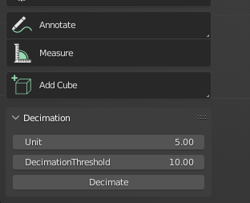
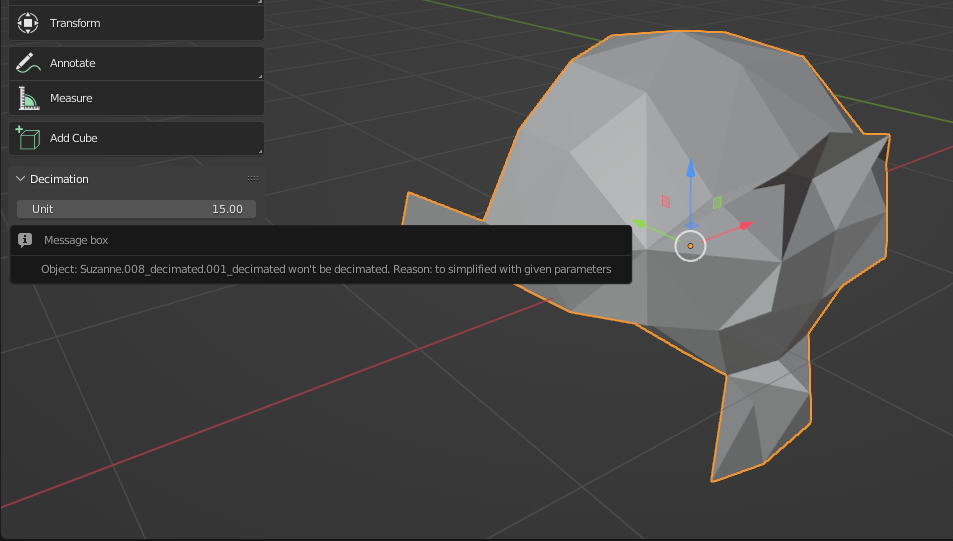

# Mesh decimation plug-in for Blender 

image::3D/images/MercedesDemo.png[DecimationDemo]

## General part

My plug-in is able to automaticly simplify ( reduce vertex/faces count ) of the mesh in blender. It works with any number of objects ( easier to simplify scenes that contains more then 1 mesh ) Also it's trying to determine if the mesh worth simplifying or it's already simplified enough. 

Blender version: 3.3.1 

OS: Windows 10 

Installation: 

- For 1 usage only: Open Blender project -> open "scripting" window -> copy-paste link:decimation.py[*script - decimation.py*] into scripting editor -> Press Run Script. You will see pop-up window in 3D viewer in object mode. 

- For integration in Blender: Open the Preferences ‣ Add-ons ‣ Install… and select the file. Now the add-on will be listed and you can enable it by pressing the checkbox, if you want it to be enabled on restart, press Save as Default. 

### Usage: 

- To use decimation plug-in you should be in object mode. Open the "tools" menu in View3D window and after installation you will se the UI of the plug-in.

- The usage is quite simple. Select as many objects as you wish in the scene, configure the parameters and press "Decimate button"

- "Unit" parameter determines the decimation level of the mesh. The lower values are => the less will be mesh decimated. Higher values => more simplified mesh. Generally it's the minimum distance between vertices in resulting mesh in centimeters. 

- "DecimationThreshold" parameter determines the threshold under which mesh won't be decimated. Higher value => object must be very detailed to pass threshold. Lower value => even small detailed meshes would be decimated

### Examples: 

- There are mesh statistics in the upper left cornet on following 4 screenshots. You can see how much is actual complexity reduction. 

 

[.text-center]
Original blender monkey model

 

[.text-center]
Blender monkey model decimated with Unit = 5 

 

[.text-center]
Blender monkey model decimated with Unit = 7

 

[.text-center]
Blender monkey model decimated with Unit = 10

 

[.text-center]
Plug-in refused to decimate already decimated monkey ( unit = 10 ) 

## Scientific part

### Motivation
I'd like to start this part with the motivation behind this plugin, and I'll try to answer the following question: "Why do we need to decimate meshes at all?" A basic user might say, “The more complex and detailed an object is, the cooler it looks, right? So why are we trying to take away “coolness”?” And in general he is right about coolness. But the more details we carry in an object, the more difficult it is for a computer to process and draw this object. Especially when we're talking about real-time graphics like in games. And this is especially important for mobile devices. For example, for a modern Oculus Quest 2 VR headset, the recommended number of triangles per frame is only 1 million. So because of this limitation, it's simply not possible to render a very high poly scene at a high frame rate. And we are back to decimation. If we can reduce the number of triangles in the scene, for example by using automatic decimation programs, we can get a higher frame rate. It is also useful for general optimization purposes. For example, if we are playing a video game and the player sees a castle far, far away, there is actually no need to render all the details of this castle (wooden gates, torches on the walls), and we can render a very low level copy of a real castle to visualize it from afar. But when the player gets closer to the castle, we will switch the model back to the detailed one, in which all the cool details exists and can be seen. 

p.s. This method is called LOD and is outside the scope of this plugin. Anyway, here is the link: link: https://en.wikipedia.org/wiki/Level_of_detail_(computer_graphics)[LOD Wiki]

The second problem that the plugin solves is file sizes. When models become extremely detailed, it may simply be a problem to write this model to disk, because this model begins to weigh hundreds of megabytes, and sometimes gigabytes. Decimation can help with this. The less detail an object contains, the smaller the final file size.

There are many different decimation algorithms and even more variations of it. I choose Vertex Clustering algorithm. It's fast, relativly simple and already was implemented on previous BI-PGA courses. 

### Vertex Clustering algorithm 

Here is the abstract description: 

1) Take all vertices of the mesh and give them a weight based on some parameters. 

2) Divide mesh in some sort of a cells with the rule that each vertex is placed only in 1 cell.  

3) Merge the vertecis in the cell into single representative vertex based on the vertex weights 

4) Connect all new representative vertecis. 

Now more detailes on each point:

1) I've used single parameters for vertex weight calculation: the probability of seeing this vertex from different points of view. It happens to be 

- cos ( the maximum angle between all of the edges that are linked with this vertex / 2 ) Here is the snippet from https://www.comp.nus.edu.sg/~tants/Paper/simplify.pdf[Paper] that explains it: 

 

2) I've used dividing in cubic cells with side of the cube ( Unit ) as a parameter 

3) The merging of vertices are done using folowing formula: P = ( W1P1 + W2P2 + ... WnPn ) / ( W1 + W2 + ... + Wn ) where Pi is the location of vertex Vi in local space and Wi is the weight of the vertex Vi 

4) Vertices were connected with following algorithm: 

    For each face in original mesh: 
        For each vertex in face find cell to which it belongs 
        If face containing representative vertecis of those cells are made only from unique cells and this face not already in result mesh: 
            add face to result mesh 

### Guessing if the mesh should be decimated 

Next thing I've tried to implement is guessing if the mesh generally needs to be decimated. E.g. if the following decimation will be "overdecimation" and will cause structural problems to the mesh => it would be good to filter out this mesh from the decimation process. 

I came up with the following heuristics:

1) The mesh is detailed more or less evenly. If one part of the mesh is greatly more detailed then the other => it can be separated into 2 meshes.  

2) The more detailed mesh is => the more vertices it has. But increase of vertices practiclly don't increase surface area of the mesh. 

3) If the surface area of both the detailed and non-detailed mesh is almost the same, but the number of vertices is different => we can calculate the ratio of the number of vertices to the surface area to determine the "level of detail" of the mesh. We can use this ratio to guess if a mesh is decimated enough by choosing some threshold constant for all meshes in the selection.

IMO that didn't came the way i imagined. I am considering this as a point for further improvmenets. It's not really working with highly detailed meshes the way as I suggested. For example the ratio of the original high-poly Mercedes Benz model from top of this doc is 332.000V / 2359776 cm^2 = ~0.14. Which is relativly small number. The ratio of blender monkey is 507 V / 12.3 cm^2 = ~41. This is nearly 100 times difference. The monkey should be decimated with Unit = 10 to reach such ratio to not pass the threhold filtering test. But the default Mercedes model will not pass the threshold by a large gap. 

I don't have a straight solution for this besides setting up precise threshold depending on the scene / meshes we are working on. Instead only few ideas for other solutions: 

1) Maybe it's better to count with faces count, not vertex count 

2) We can try to play with model shape before / at time / after the decimation to determine if the mesh got some structural damage due to decimation. For example take top-down projection view, consturct some kind of a shape object and calculate if the decimated mesh is saving this shape enought to count this as valid decimation. 

## Programming part 

My plug-in is heavily based on beautiful link:https://gitlab.fit.cvut.cz/BI-PGA/stud/linhaold/blob/master/dokumentace3.adoc[plug-in] by Oldřich Linhart. Most parts of the Vertex Clustering algorithm were taken from his work and I've tryed to improve them. 

### Analysis 

Some points on Oldřich Linhart plug-in: 

1) It's capable to Decimate a only single mesh at time. 

2) He stores a lot of data into plug-in member variables and uses big methods that doing a lot of things at once. 

3) It contains a bug at math part and the bug that don't allow you to run the plug-in 2 times in a row 

Sounds like pure criticism, but I actually really like his plugin. These are actually the only things I found to improve on it. Other than that it works very well :)

So I came up with the following improvements: 

1) Expand the work of the plug-in to work the multiple meshes at time 

2) Refactor the whole data model to not save unnecessary state variables and also to allow plug-in work with multiple meshes + refactor methods to be more or less SRP 

3) Fix the bugs 

And also work on following extensions: 

1) Create a system to guess if the mesh is already decimated enough 

2) Add logging and profiling. If a plugin does a lot of different things and can take a few minutes to process, I think it's necessary to have profiling tools to optimize further.

### Interesting parts of code 

Here is the snipper from plugin.execute method 

[source, python]
        selected_objects = bpy.context.selected_editable_objects
        filtered_objects = self.filter_objects_to_decimate( selected_objects )
        meshes = self.objects_to_meshes ( filtered_objects )
        self.triangulate_meshes ( meshes )
        objects_bounds = self.get_objects_bounds ( filtered_objects )
        vertex_lists = self.create_vertex_lists ( meshes )
        cell_grids = self.create_cell_grids ( vertex_lists, objects_bounds )
        decimated_objects = self.create_decimated_objects ( filtered_objects )
        self.push_simplified_geometry_to_objects ( decimated_objects, meshes, cell_grids, vertex_lists )
        self.free_meshes ( meshes )

As you can see all the methods are rebuild the way to take a multiple objects as parameters. Also the plug-in doesn't store any extra state variables and doing everything locally. 

Here is method that filters out all objects that won't be decimated 
[source, python]
def filter_objects_to_decimate ( self, objects : list[bpy.types.Object] ):
        self.m_profiler.StatBegin()  
        objects_to_decimate = [] 
        for object in objects:
            if object.type != 'MESH':
                self.m_logger.ShowMessageBox ("Object: " + object.name + " won't be decimated. Reason: not a mesh")
                continue 
            if not self.is_object_should_be_decimated ( object ):
                self.m_logger.ShowMessageBox ("Object: " + object.name + " won't be decimated. Reason: to simplified with given parameters")
                continue
            objects_to_decimate . append ( object )
        self.m_logger.Log ( "Filtering took: " + str ( self.m_profiler.StatEnd() )+ " seconds" )
        return objects_to_decimate

Here is the method that calculates the ratio of triangles to surface area to decide if object will be decimated or not. 
[source, python]
def is_object_should_be_decimated ( self, object : bpy.types.Object ):
        surface_area = self.get_object_surface_area ( object )
        self.m_logger.Log ("Object: " + str ( object.name ) + " surface area = " + str ( surface_area ) )
        self.m_logger.Log ("Object: " + str ( object.name ) + " # of vertices = " + str ( len ( object.data.vertices ) ) )
        ratio =  ( len (object.data.vertices) / ( surface_area ) )  # To verts / square cm  
        self.m_logger.Log ("Object: " + str ( object.name ) + " vertecis/surface ratio = " + str ( ratio ) )
        return ratio >= self.m_decimation_threshold

Here is the function that calculates weight of the vertex. 

[source, python]
def grade_vertex_impl ( self, vertex : D_Vertex ): 
        return math.cos ( CalculateVertexMaxAngle ( vertex ) / 2 )

Also here is my improved GetAngleBetweenVectos() method. Added some checks to prevent math errors in edge cases: 
[source, python]
def GetAngleBetweenVectors ( v1 : Vector, v2 : Vector ):
    v1_l = v1.length
    v2_l = v2.length
    if math.isclose(0, v1_l) or math.isclose(0, v2_l):
        return 0
    cos_theta = ( v1 . dot  ( v2 ) ) / ( v1_l * v2_l )
    if cos_theta > 1 or cos_theta < -1: 
        return 0
    return math.acos(cos_theta)

In cell grid creating I'am using nice Oldřich methods that calculates vertex cell location by truncating it's location in right way
[source, python]
def calculate_cell_location ( self, vertex : D_Vertex, unit : float, object_bounds : tuple ):
        x_min = object_bounds[0][1] # min X 
        y_min = object_bounds[1][1] # min Y 
        z_min = object_bounds[2][1] # min Z 
        x_len = vertex.v_info.co.x - x_min
        y_len = vertex.v_info.co.y - y_min
        z_len = vertex.v_info.co.z - z_min
        x_component = x_min + unit * int( math.floor( x_len / unit ) )
        y_component = y_min + unit * int( math.floor( y_len / unit ) )
        z_component = z_min + unit * int( math.floor( z_len / unit ) )
        return Vector ( ( round( x_component, 10 ), round( y_component, 10 ), round( z_component, 10 ) ) )

All decimated objects are pushed in different collection with _decimated postfix in name 
[source, python]
def create_decimated_objects ( self, objects : list[bpy.types.Object] ) -> list[object]:
        self.m_profiler.StatBegin() 
        decimated_objects = []
        collection = bpy.data.collections.new( name = "Decimated Objects")
        bpy.context.scene.collection.children.link(collection)
        for object in objects:
            obj = self.create_decimated_object ( object, object.parent )
            collection.objects.link ( obj ) 
            decimated_objects . append ( obj )
        self.m_logger.Log ("Objects creation took: " + str ( self.m_profiler.StatEnd() ) + " seconds" )
        return decimated_objects

I don't know exactly what is the main problem that prevents to run Oldřich Linhart plug-in 2 times in a row. I only have a suggestion that it's in the reindexing of the mesh vertices in his self.connect() method. My plug-in uses different connection method and i didn't found this kind of problem in it. 
[source, python]
def connect_mesh_simplified_geometry ( self, mesh : bmesh.types.BMesh, orig_mesh : bmesh.types.BMesh, orig_vertex_list : list [ D_Vertex], mapped_cells ):
        new_faces_cell_indecis = []
        for face in orig_mesh.faces: 
            face_orig_indecis = [ v.index for v in face.verts]
            face_orig_vertices = [ orig_vertex_list [ i ] for i in face_orig_indecis ]
            face_cell_indecis = [ v.cell_index for v in face_orig_vertices ]
            face_cell_indecis_sorted = face_cell_indecis
            # spent here 2 hours figuring out that ( list_sorted = list.sort() ) == None (:
            face_cell_indecis_sorted.sort()
            if len ( set ( face_cell_indecis ) ) != len ( face_cell_indecis ) or face_cell_indecis_sorted in new_faces_cell_indecis: 
                continue
            face_new_vertices = [ mapped_cells[i] for i in face_cell_indecis ] 
            new_faces_cell_indecis . append ( face_cell_indecis_sorted )
            mesh.faces . new ( face_new_vertices )

The profling is done with simple profiling class that has StatBegin() and StatEnd() methods. It's used in all methods and results are printed using Logger class. 

[source, python]
def create_cell_grids ( self, vertex_lists : list[list[D_Vertex]], objects_bounds ): 
        self.m_profiler.StatBegin() 
        cell_grids = [] 
        for vertex_list, object_bounds  in zip ( vertex_lists, objects_bounds ) :
            cell_grids . append ( self.create_cell_grid ( vertex_list, object_bounds ) )
        self.m_logger.Log ( "Cell grids building took: " + str ( self.m_profiler.StatEnd() ) + " seconds" ) 
        return cell_grids

